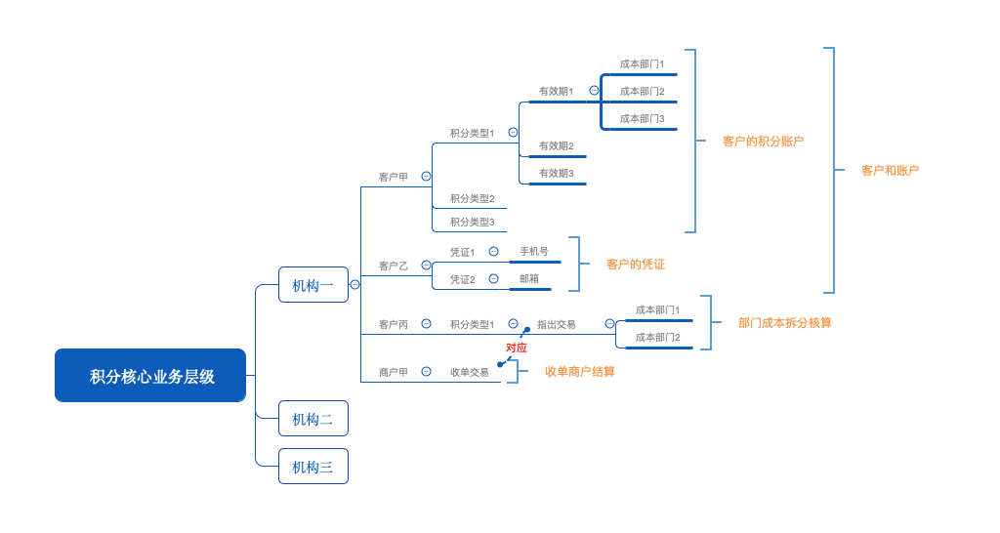
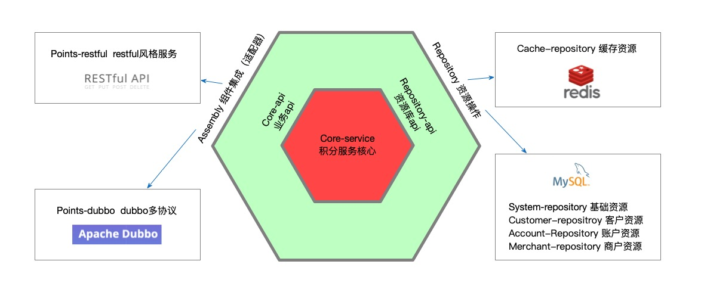

@Author Shade.Yang

<h1 align="center" style="margin: 30px 0 30px; font-weight: bold;">POINTS V3.0</h1>
<h4 align="center">DDD设计模式下的积分核心points_3.0系统</h4>

    
    
    
    

## 平台简介

积分作为营销的基本工具，常见于生活各个方面。银行卡积分、航空里程积分、商城积分、客户VIP积分等级等。

虽然积分的使用场景千奇百怪，但是对于积分的核心，记账与成本核算功能不曾改变。

本平台采用DDD的设计模式最紧合的六边形架构来进行业务实现，业务架构清晰，同时具有各种不同场景下自由适配的可能性。

## 业务特性

本系统设计重在业务核心（积分）的设计，从原则上来讲，只要满足核心业务的接口层抽象，可以自行实现各种业务场景代码，当前以已实现的业务进行特性描述。

1. 支持多机构（租户）隔离：设计上以机构作为数据归属，所有的积分类型、账户、商户等均可进行机构的关联

2. 机构下多积分类型支持：每个机构可以存在多种积分类型，可以分别定义别名、积分价值比例等

3. 客户下多积分账户支持：每个客户可拥有当前机构下多个积分类型账户

4. 客户下多凭证支持：每次客户交易时，可能使用不同的交易凭证，均可找到对应客户及账户

5. 同一积分下不同有效期：一个积分账户下，所拥有的积分可以存在不同的有效期

6. 积分消费成本拆账：一笔积分消费，根据所耗费积分数值来源不同的费用承担部门进行应付成本拆分核算

7. 积分消费商户收单清算：根据积分消费的收单商户，进行应收费用的结算

## 架构设计

架构以领域驱动（DDD）进行设计，赋予了最大的架构适配灵活度，展现为如下的六边形架构。

当前系统领域定义：

| 领域名      | 领域说明                                             |
| -------- | ------------------------------------------------ |
| points   | 积分全域定义，当前系统全域定义为points，其余均为points子域              |
| system   | 基础领域资源，与points业务无关，作为基础参数配置相关域，包括系统字典、系统标签、机构等   |
| cache    | 缓存领域资源，进行数据共享缓存，全局共享锁等缓存操作                       |
| customer | 客户领域资源，客户身份信息以及用于身份认证的凭证信息                       |
| account  | 账户领域资源，积分的核心领域资源，涉及积分账户，交易流水，积分成本拆分等核心积分相关业务资源操作 |
| merchat  | 商户领域资源，用于收单交易商户对象相关的操作                           |

## 

以积分服务核心为六边形中心，封装积分核心的主体业务。

- 下层资源库当前为redis和mysql作为资源实现，均可根据实际资源对象进行调整满足落地要求。除了account-repository作为积分业务的核心资源实现，调整可能性不大，其他均可以任意调整，仅仅只需要按照现有repository-api进行接口实现即可。
  
  > 比如当积分核心嵌于其他应用或者作为微服务群中的一个业务模块，system-repository，customer-repository，merchat-repository都可能直接操作已有资源或接口服务来完成资源操作。当系统架构无redis或单机服务时，cache-repository可以调整为数据库加锁或内存加锁。

- 上层资源库当前以实现了restful和dubbo服务为例子，同样可根据当前实施技术架构要求，对core-api提供的接口进行另外的封装服务。

## 主要依赖

## 快速启动

1. 当前默认实现时使用redis和mysql进行资源操作，所以启动之前需准备此环境

2. 建立mysql表结构，依次执行创建以下sql
   
   > repository/account-repository/sql/mysql/ddl/account.sql
   > 
   > repository/customer-repository/sql/mysql/ddl/customer.sql
   > 
   > repository/customer-repository/sql/mysql/ddl/voucher.sql
   > 
   > repository/merchant-repository/sql/mysql/ddl/merchant.sql
   > 
   > repository/system-repository/sql/mysql/ddl/institution.sql
   > 
   > assembly/points-restful/backend-restful/sql/mysql/ddl/sys.sql

3. 更改本地的数据库及redis配置
   
   > assembly/points-restful/backend-restful/src/main/resources/application.yml
   
   若准备使用docker修改此文件的配置
   
   > assembly/points-restful/backend-restful/src/main/resources/application-docker.yml

4. 启动应用

        IDE直接启动应用，运行springboot启动方法：`com.wt2024.points.restful.backend.ProviderLauncher#main`

        docker容器启动应用，执行`assembly/points-restful/backend-restful/bin/build.sh` 构建本地docker镜像，完成后`assembly/points-restful/backend-restful/bin/run.sh` 启动docker容器。

## 欢迎交流

若大家有更好的建议与想法，欢迎与我联系：

## 捐赠支持

创作不易，您可以请作者喝瓶可乐表示鼓励
